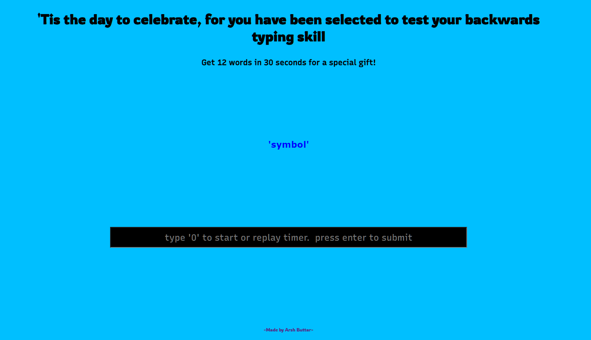

# Backward Words

an interactive web app I made as my introduction to web development

built with pure HTML, CSS and Javascript. Hosted on Netlify

## What is this?
**'twas a cool summer evening as I browsed r/wallstreetbets when suddenly a light bulb lit in my head and I gained the most splendid ide-**

just kidding. for a much faster explanation, check out the app **[here](https://backwardwords.netlify.app/)**

## Contribution and Reproduction
please do feel free to submit a pull request if you would like to improve this application, I am sure there's a lot of that to be done

you are more than welcome to build upon this app, but please do keep in mind that this is GNU GPLv3 licensed so any modifications will have to be licensed under GPLv3 as well

## Attributions
* [Netlify](https://www.netlify.com/) - for hosting the app
* [Random Words](https://www.npmjs.com/package/random-words) - for word list 
* [Wrong icon](https://iconscout.com/icon/wrong-1478329) 
* [Checkmark icon](https://iconscout.com/icon/right-1478289) 

